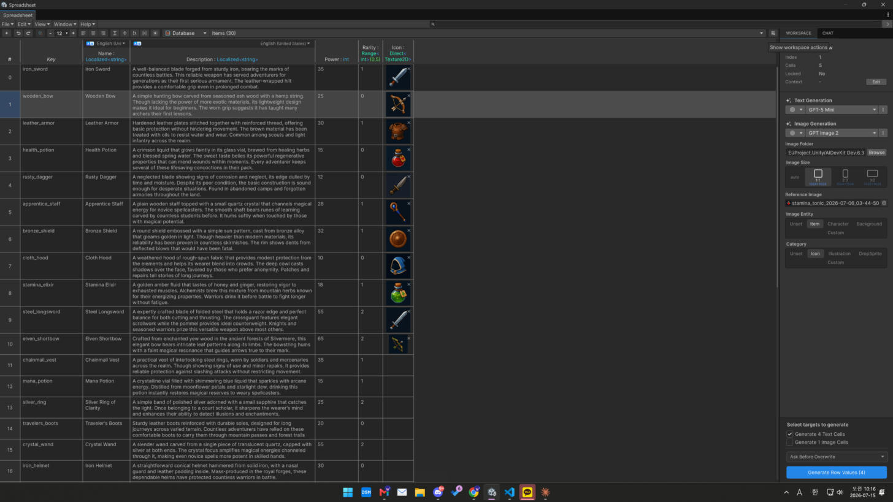

# Content Generation

Generate table content from natural-language prompts, right in the
[Spreadsheet Editor](../spreadsheet-editor/README.md). Requires an AI provider/API key
(see [Providers & API Keys](../setup/providers.md)).

## What you can generate

* **Rows** — generate N new entries that follow the table's schema.
* **Cells** — fill selected/empty cells in a row from a prompt.
* **Images** — for `Sprite` / `Texture2D` columns (text-to-image).
* **Audio** — for audio columns (voice / SFX / music).
* **Image edit (inpaint)** — edit an existing image cell from an instruction prompt.

## How to use

1. Select the target rows/cells (or choose "generate new rows").
2. Open the generation action in the side panel and enter a prompt.
3. The AI uses the table **schema** (column names + types) to produce values that fit.

<figure><figcaption></figcaption></figure>

## Per-column settings

Image/audio columns carry generation settings (model, image size, voice, output folder).
Configure these in the column settings so generated assets are saved and assigned correctly.

## Tips

* Give the table meaningful column names — the AI reads them as the schema.
* Use **Contextual Keys** and cell context to steer tone and domain.
* Generation overwrites only where you allow it; empty cells are the usual targets.

> External assets created by image/audio generation are real files in your project — they are
> not removed by Unity's Undo. Delete unwanted generated assets manually.
