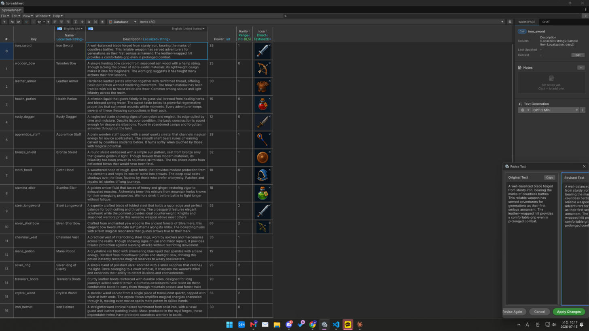

# Text Revision

Refine the wording of a text cell with AI — clean up, rephrase, or fix a string in place
(this edits text; it does not translate). Requires an AI provider/API key
(see [Providers & API Keys](../setup/providers.md)).

## How to use

1. Select a text cell.
2. Run **Revise** (side panel / cell action).
3. The AI returns improved text; apply it to the cell.

<figure><figcaption></figcaption></figure>

## Notes

* Cell context and your configured text model steer the result.
* The change goes through the normal edit pipeline, so it is undoable.
* To translate (not rewrite) text, use [Translation](../localization/translation.md).
