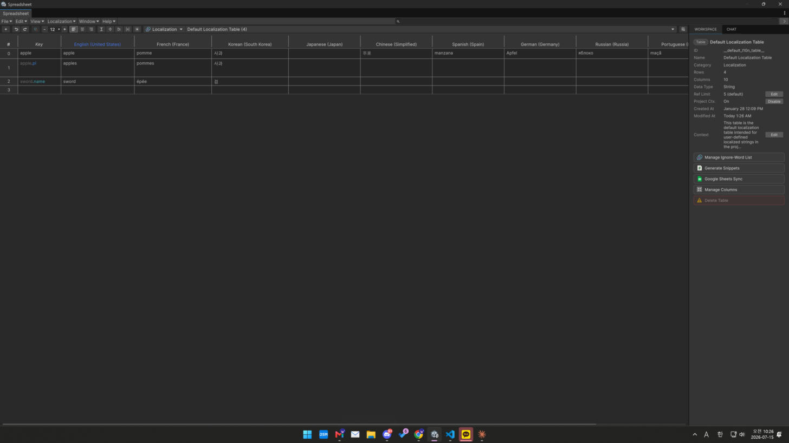

# Localization

A Localization table is a **key column + one column per language (Locale)**. You author the
keys and translations in the [Spreadsheet Editor](../spreadsheet-editor/README.md), then read
them at runtime with the `Localization` API or drop-in components.

<figure><figcaption></figcaption></figure>

## Editor workflow

1. Create a table with the **Localization** category.
2. Add a **Locale** column per language you support.
3. Add rows (keys) and fill translations — or let AI fill the missing cells
   (see [Translation](translation.md)).
4. (Optional) Generate localization key snippets, or create keys from existing scene text
   (Scene Text Localization).

## Tools that help

* **AI / Google / Microsoft translation** — fill missing cells in one pass.
* **Compare Translations** — review translations across languages for gaps/inconsistencies.
* **Contextual Keys** — give the AI context so translations fit your game's tone.
* **Import / Export** — CSV / TSV / JSON / **XLIFF** for professional translation tools.

## Using it at runtime

Two ways, often combined:

* **Code** — `"key".Tr()` and the `Localization` facade. See [Runtime API](runtime-api.md).
* **Components** — `TextLocalization`, `SpriteLocalization`, etc., that update on locale change.
  See [Unity Components](components.md).

For on-the-fly translation of text that isn't in a table, see [Realtime Translation](realtime-translation.md).
