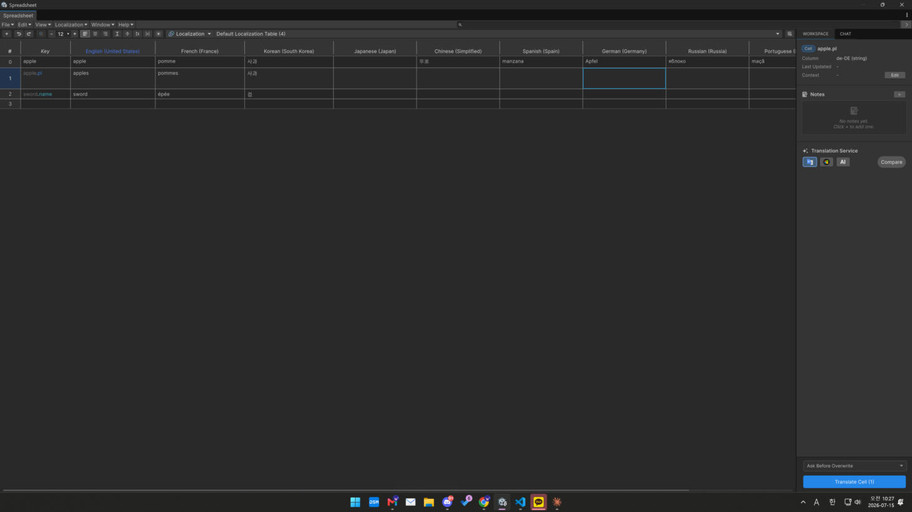

# Translation

Fill missing translations in a [Localization](README.md) table automatically. This is an
editor-time, table-based workflow. (To translate dynamic/UGC text at runtime, see
[Realtime Translation](realtime-translation.md).)

<figure><figcaption></figcaption></figure>

## Backends

Choose the translation service per table/column:

* **AI translation** — uses your configured AI provider; context-aware (understands tone/terms).
* **Google Translate** — Google's machine-translation service. *(Not AI — a dedicated MT service.)*
* **Microsoft Translator** — Microsoft's machine-translation service. *(Not AI — a dedicated MT service.)*

Each backend needs its key configured — see [Providers & API Keys](../setup/providers.md).

## Workflow

1. Open a Localization table with one or more language columns.
2. Detect/select the missing cells (gaps across languages).
3. Run translation — the chosen backend fills the empty target cells from the source language.
4. Review with **Compare Translations** if needed.

## Context for better results (AI backend)

* **Contextual Keys (Localization)** — register context hints so the AI understands your game's
  terms and tone.
* Per-cell context and existing translations are passed to the AI backend as extra context.
  (Google / Microsoft machine translation don't use this — they translate the text directly.)

## Editing existing text

To refine wording rather than translate, use [Text Revision](../ai-features/text-revision.md) —
an AI rewrite of a text cell.
