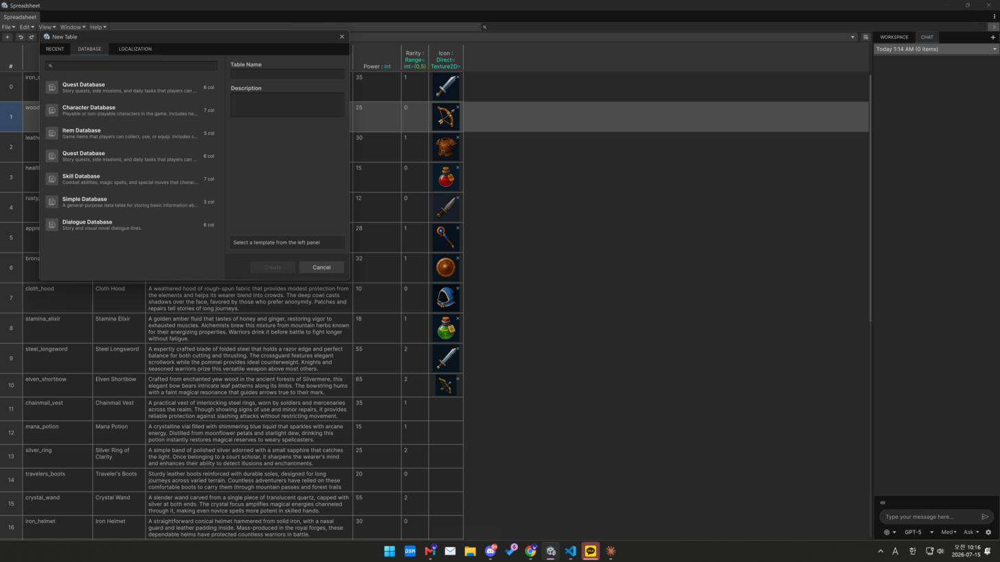
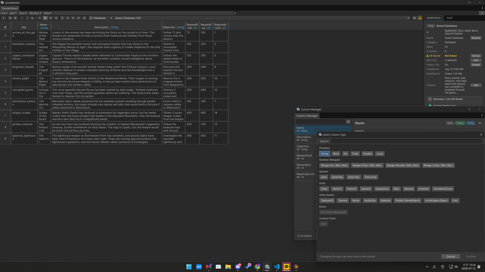
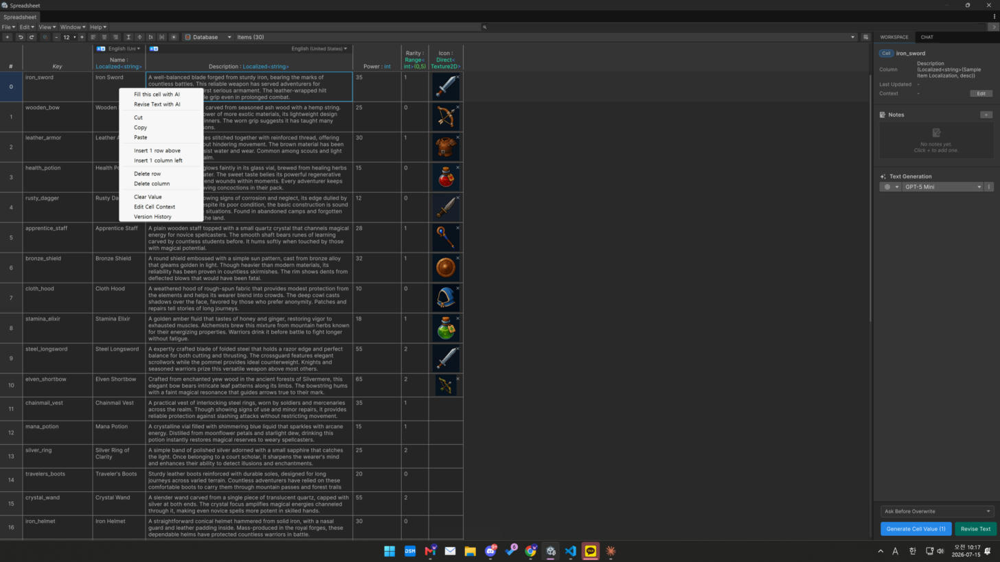

# Editing Tables

How to create and edit tables in the Spreadsheet window.

## Create a table

`New Table` from the toolbar's File menu. Choose a category (**Database** or **Localization**)
and a name.

<figure><figcaption></figcaption></figure>

## Columns

Use the **Column Manager** to add/remove columns and set each column's **data type**
(string, int, enum, Sprite, …). See [Supported Data Types](../reference/data-types.md).

<figure><figcaption></figcaption></figure>

## Rows & cells

* Add / insert / delete rows; sort by key.
* Edit cells inline; multi-select; copy / paste.
* **Cell notes** — annotate a cell. **Version history** — restore a cell's previous value.

<figure><figcaption></figcaption></figure>

## Find, replace & bulk edits

Search and replace across the table, and apply bulk operations to a selection (trim, sort,
key case).

## Undo / Redo

Explicit edits are undoable — toolbar buttons, **Ctrl/Cmd+Z** / **Ctrl/Cmd+Shift+Z**, or Unity's
`Edit > Undo`. A whole inline edit collapses into a single undo step. See
[Keyboard Shortcuts](../reference/keyboard-shortcuts.md).
