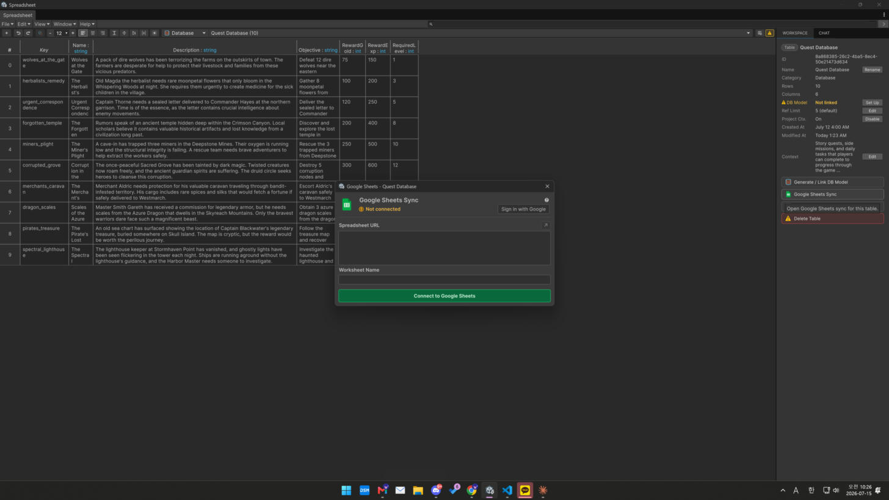

# Google Sheets Sync

Push to and pull from Google Sheets directly from the editor, keeping a shared team sheet in
sync with your Unity tables.

<figure><figcaption></figcaption></figure>

## Setup

Follow the in-editor Google Sheets guide to authorize and link a spreadsheet (spreadsheet ID +
sheet name). Configure the Google Translate / API keys in
[Providers & API Keys](../setup/providers.md) if you also use Google translation.

## Push / Pull

* **Push** — upload the current table to the linked Google Sheet.
* **Pull** — import the linked Google Sheet back into the table (uses the same
  [Merge Rules](../reference/merge-rules.md) as file import).

> 📷 **Image — `google-sheets-sync.png`:** A table next to its synced Google Sheet, showing
> matching columns/rows.

> **Note:** For shipped builds, prefer a baked local source (CSV/JSON/ScriptableObject) as the
> runtime data source — Google Sheets is best for editor-time authoring/sync, not as a runtime
> dependency.
